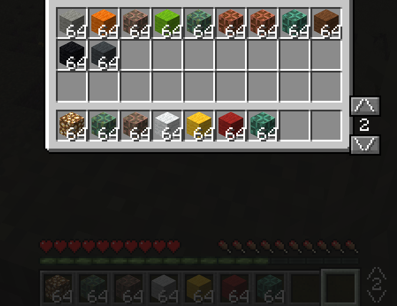

# MultiHotbar

A NeoForge mod for Minecraft 1.21.1 that adds multiple switchable hotbars.

## Features

- Switch between 1 and 5 independent hotbars using keybinds or buttons
- Hotbar indicator displayed to the right of the vanilla hotbar showing the current index and navigation arrows
- Swap hotbars from any container screen (inventory, chest, crafting table...) using keybinds or the in-screen buttons
- Hotbars persist across sessions, deaths, and respawns
- Configurable hotbar count via server config or in-game command
- Items from removed hotbars are redistributed to free slots, excess is dropped at player's feet

## Keybinds

| Key | Action |
|-----|--------|
| `R` | Next hotbar |
| `F` | Previous hotbar |

Both keys can be rebound in Options → Controls. They work both in-game and in any container screen.

## In-inventory buttons



When opening your inventory, a chest, a crafting table, or any other container, two buttons appear to the right of your hotbar row:

- `∧` — next hotbar
- number — current hotbar index
- `∨` — previous hotbar

## Commands

| Command | Description |
|---------|-------------|
| `/multihotbar setcount <n>` | Sets the hotbar count (1–5), applied on relog |
| `/multihotbar setcount <n> force` | Sets the hotbar count and applies immediately to all connected players |

Requires operator level 2. Works from the server console without `/`.

When reducing the count, items from removed hotbars are redistributed to free slots in remaining hotbars. Items that don't fit are dropped at the player's feet.

## Installation

1. Install [NeoForge 21.1.228](https://neoforged.net/) or later for Minecraft 1.21.1
2. Drop `multihotbar-1.0.0-1.21.1.jar` into your `mods/` folder
3. Launch the game

## Configuration

The config file is generated on first launch at:

```
config/multihotbar-server.toml
```

```toml
[hotbars]
# number of hotbars available to the player (min 1, max 5)
hotbarCount = 3
```

Change the value and restart the world for it to take effect. Existing hotbar data is preserved.

Note: changing the config while players are connected has no effect until they relog, unless you use `/multihotbar setcount <n> force`.

## Compatibility

- Minecraft 1.21.1
- NeoForge 21.1.228+
- Server-side config (clients connecting to a server use the server's configured value)

## Building from source

```bash
./gradlew build
```

Output: `build/libs/multihotbar-1.0.0-1.21.1.jar`

## License

MIT